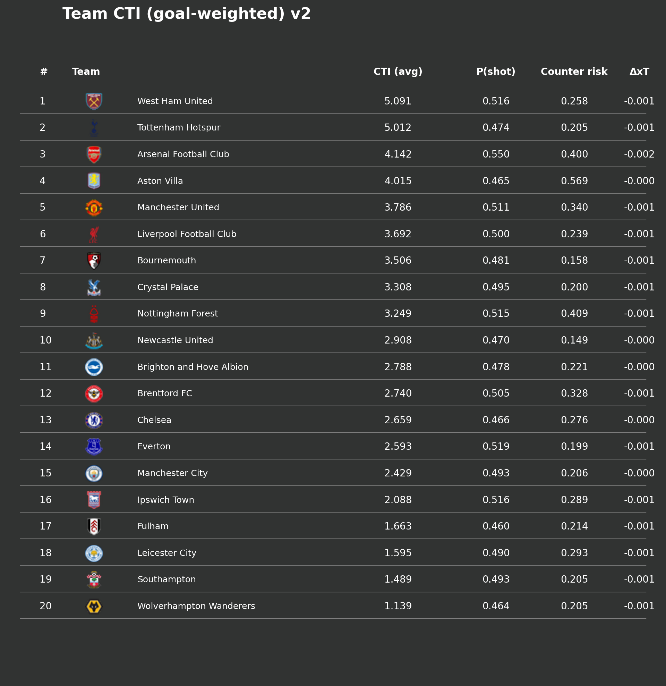
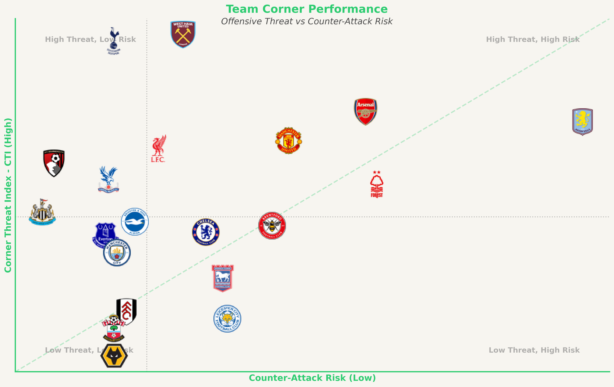
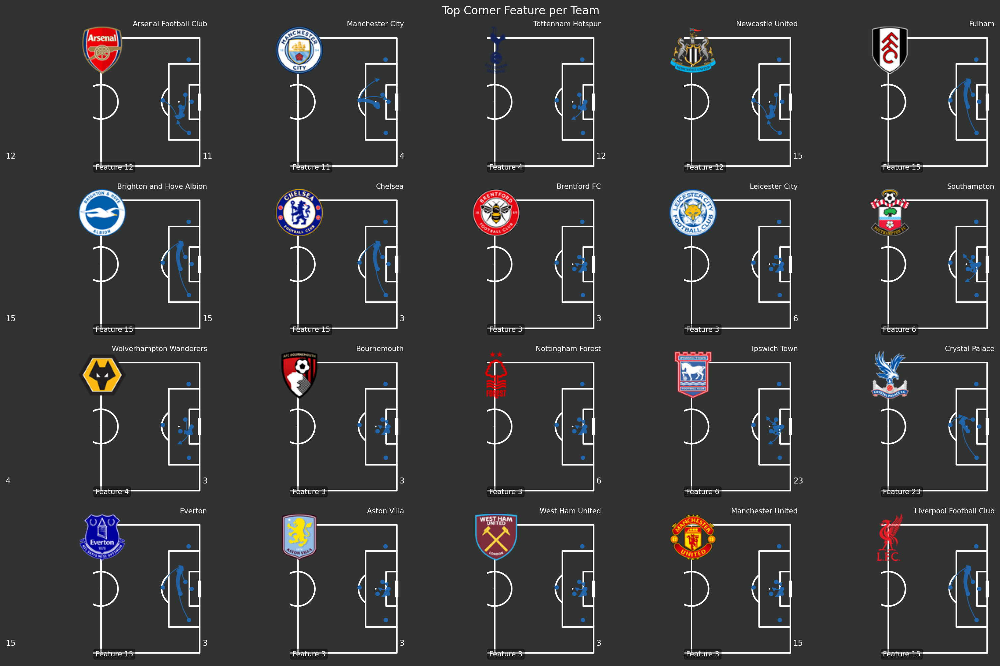

# Corner Threat Index (CTI)

<p align="center">
  
</p>

A Graph Neural Network-based system for evaluating corner kick quality in soccer using tracking and event data.

---

## 🎓 Course Context

This project was developed as the final project for the **Deep Learning and AI in Sport** course by **Twelve Football**.

> **⚠️ Data Availability & Privacy Notice**
>
> The tracking and event data used in this project was provided by **SkillCorner** exclusively for educational purposes as part of the **Twelve Deep Learning** course.
> **It is not publicly available** and cannot be shared. Access to this data was granted solely for the duration and scope of this course.

---

## 📊 Project Outputs

### Team Performance Summary


### Offense vs Counter-Attack Risk


### Tactical Patterns (NMF Features)


---

## 📚 Documentation

The documentation has been organized into the following guides:

*   **[01_Technical_Guide.md](documentation/01_Technical_Guide.md)**: Complete technical framework, architecture, and implementation details.
*   **[02_User_Guide.md](documentation/02_User_Guide.md)**: Step-by-step guide for installation, running the pipeline, and troubleshooting.
*   **[03_Methodology_and_Insights.md](documentation/03_Methodology_and_Insights.md)**: Detailed explanation of the CTI formula, models, and coaching applications.
*   **[04_Results_and_Reports.md](documentation/04_Results_and_Reports.md)**: Summary of results, reliability/calibration reports, and validation metrics.

---

## 🚀 Quick Overview

The **Corner Threat Index (CTI)** quantifies the offensive value of corner kicks by combining five key components:

```math
CTI = y_1 \cdot y_2 - \lambda \cdot y_3 \cdot y_4 + \gamma \cdot y_5
```

*   **y₁**: Probability of a shot within 10s.
*   **y₂**: Expected Goals (xG) of that shot.
*   **y₃**: Probability of a counter-attack.
*   **y₄**: Risk (xG against) of the counter-attack.
*   **y₅**: Territory gained (ΔxT).

For detailed instructions on how to run the code, please refer to the **[User Guide](documentation/02_User_Guide.md)**.

---

## 🙏 Acknowledgments

A special thank you to the course instructors and mentors for their guidance and support throughout this project:

*   **David Sumpter**: For his incredible contributions to the football analytics community and for leading this course with such insight.
*   **Pegah**: For her excellent administration and smooth organization of the course.
*   **Dimitris**: For being a fantastic mentor, providing invaluable advice, technical considerations, and support during the development of this project.

---

*Author: Tiago*
*Date: 2025-12-06*
